# Educational Data Mining (EDM) Techniques for Predicting Student Academic Performance
Sneha Dingre  
22 October 2017  


##Problem Definition:
* Evaluating different factors affecting a student's academic performance:
     + **_Academic background factors_** : Educational stages, grade, levels, course topic
     + **_Behavioral factors_** : Raised hand, visited resources, discussion groups, etc.
     + **_Demographic factors_** : Nationality, gender, place of birth, etc.
  
* Use EDA to analyze how each of the factors in above mentioned categories contribute individually to student's academic performance as well as finding correlation between factors. 

* Building a predictive model using algorithms like Decision Tree to predict a student's performance based on these factors.

* Evaluating performance of the model developed.


```r
library(plyr)
library(ggplot2)
```

```
## Warning: package 'ggplot2' was built under R version 3.3.3
```

```r
library(moments)
library(cluster)

library(randomForest)
```

```
## Warning: package 'randomForest' was built under R version 3.3.3
```

```
## randomForest 4.6-12
```

```
## Type rfNews() to see new features/changes/bug fixes.
```

```
## 
## Attaching package: 'randomForest'
```

```
## The following object is masked from 'package:ggplot2':
## 
##     margin
```

```r
edu <- read.csv(file = "E:/Sneha/Spring 17/6160-KDD/Project KDD/xAPI-Edu-Data.csv", stringsAsFactors = FALSE)

gender <- edu$gender
nationality <- edu$NationalITy
hands <- edu$raisedhands
birthplace <- edu$PlaceofBirth
```
We're going to use EDA to visualise the data of each of the predictor variable and to analyse the relations between predictor variables and in between predictor variables and the target variables

## 1. Visualizing demographic information: Nationality

```r
ggplot(data=edu,aes(x=nationality)) + geom_bar() + 
  geom_text(stat='count',aes(label=..count..),vjust=-1)
```

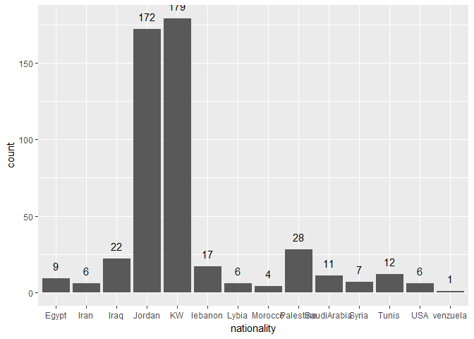<!-- -->

##2. Visualizing demographic information: Gender

```r
#bar chart for gender
ggplot(data=edu,aes(x=gender)) + geom_bar() + 
  geom_text(stat='count',aes(label=..count..),vjust=-1)
```

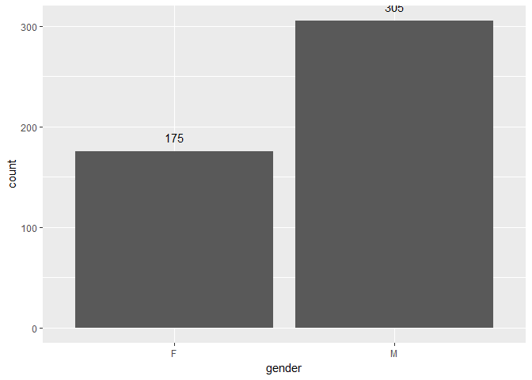<!-- -->
We can see that the place of birth and nationality are the same for most records and hence we will consider only nationality for our analysis.


###3. Visualizing student information for Fall and Spring semesters

```r
ggplot(data=edu,aes(x=Semester)) + geom_bar() + 
  geom_text(stat='count',aes(label=..count..),vjust=-1)
```

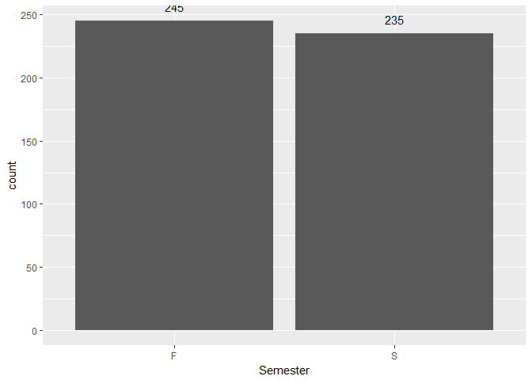<!-- -->

###4. Bar chart for topic

```r
ggplot(data=edu,aes(x=Topic)) + geom_bar() + 
  geom_text(stat='count',aes(label=..count..),vjust=-1)
```

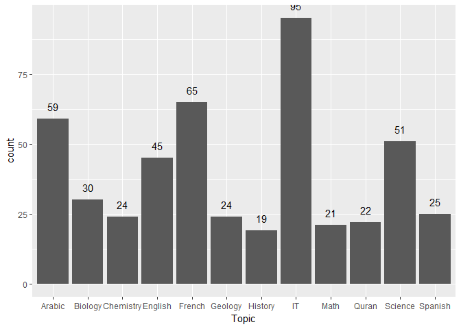<!-- -->

```r
#Parental Information
#renaming mum to Mother in Relation for more consistent naming.
edu$Relation[(edu$Relation) == "Mum" ] <- "Mother"

pResp <- edu$Relation
pSurvey <-edu$ParentAnsweringSurvey
pSat <- edu$ParentschoolSatisfaction
```

###5. Bar chart for parent responsible for student

```r
ggplot(data=edu,aes(x=pResp)) + geom_bar() + 
  geom_text(stat='count',aes(label=..count..),vjust=-1)
```

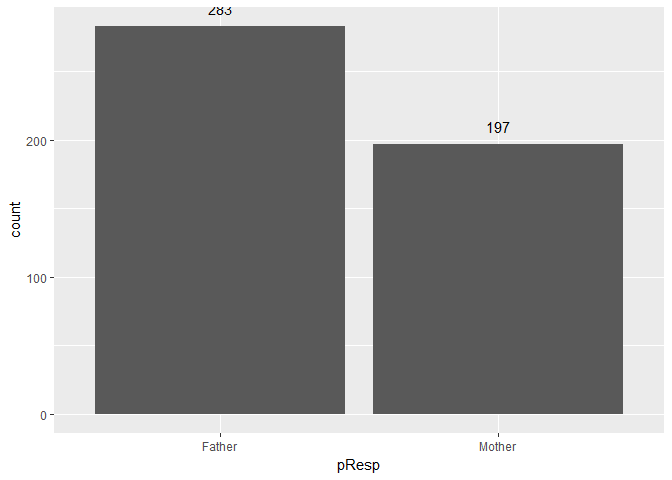<!-- -->

###6. Bar chart for parent answering survery

```r
ggplot(data=edu,aes(x=pSurvey)) + geom_bar() + 
  geom_text(stat='count',aes(label=..count..),vjust=-1)
```

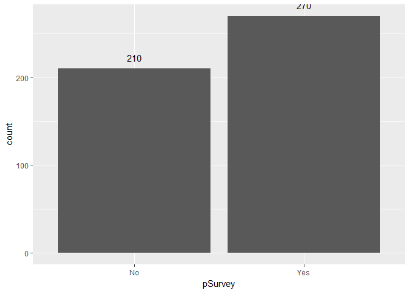<!-- -->

###7.Bar chart for parent's satisfaction with school

```r
ggplot(data=edu,aes(x=pSat)) + geom_bar() + 
 geom_text(stat='count',aes(label=..count..),vjust=-1)
```

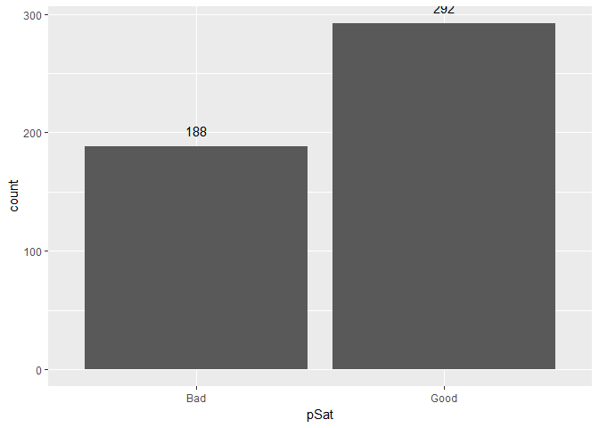<!-- -->

Decision tree performs well with categorical data, rather than continuous data. Therefore we will use k-means clustering for binning our 4 behavioral variables into 3 bins, i.e. low, moderate and high: 

###Binning/ Discretizing _raisedHands_ into low, moderate and high:


```r
rhand <- edu$raisedhands
rhand.cluster<-kmeans(rhand, 3, nstart=20)
#storing the result of clustering
rhand.cluster<- rhand.cluster$cluster
#changing the column values to the cluster
edu$raisedhandsBinned <- rhand.cluster

min_clust1=min(edu$raisedhands[(edu$raisedhandsBinned)=="1"])
min_clust1
```

```
## [1] 32
```

```r
min_clust2=min(edu$raisedhands[(edu$raisedhandsBinned)=="2"])
min_clust2
```

```
## [1] 0
```

```r
min_clust3=min(edu$raisedhands[(edu$raisedhandsBinned)=="3"])
min_clust3
```

```
## [1] 65
```

```r
if(min_clust1<min_clust2 && min_clust1<min_clust3){
  minvalue=1
} else if(min_clust2<min_clust1 && min_clust2<min_clust3){
  minvalue=2
} else {
  minvalue=3
}
edu$raisedhandsBinned[(edu$raisedhandsBinned) == minvalue ] <- "Low"

if(min_clust1>min_clust2 && min_clust1>min_clust3){
  maxvalue=1
} else if(min_clust2>min_clust1 && min_clust2>min_clust3){
  maxvalue=2
} else {
  maxvalue=3
}
edu$raisedhandsBinned[(edu$raisedhandsBinned) == maxvalue ] <- "High"


val<-which((edu$raisedhandsBinned=="1"))
edu$raisedhandsBinned[val] <- "Moderate"
val<-which((edu$raisedhandsBinned=="2"))
edu$raisedhandsBinned[val] <- "Moderate"
val<-which((edu$raisedhandsBinned=="3"))
edu$raisedhandsBinned[val] <- "Moderate"

head(edu)
```

```
##   gender NationalITy PlaceofBirth    StageID GradeID SectionID Topic
## 1      M          KW       KuwaIT lowerlevel    G-04         A    IT
## 2      M          KW       KuwaIT lowerlevel    G-04         A    IT
## 3      M          KW       KuwaIT lowerlevel    G-04         A    IT
## 4      M          KW       KuwaIT lowerlevel    G-04         A    IT
## 5      M          KW       KuwaIT lowerlevel    G-04         A    IT
## 6      F          KW       KuwaIT lowerlevel    G-04         A    IT
##   Semester Relation raisedhands VisITedResources AnnouncementsView
## 1        F   Father          15               16                 2
## 2        F   Father          20               20                 3
## 3        F   Father          10                7                 0
## 4        F   Father          30               25                 5
## 5        F   Father          40               50                12
## 6        F   Father          42               30                13
##   Discussion ParentAnsweringSurvey ParentschoolSatisfaction
## 1         20                   Yes                     Good
## 2         25                   Yes                     Good
## 3         30                    No                      Bad
## 4         35                    No                      Bad
## 5         50                    No                      Bad
## 6         70                   Yes                      Bad
##   StudentAbsenceDays Class raisedhandsBinned
## 1            Under-7     M               Low
## 2            Under-7     M               Low
## 3            Above-7     L               Low
## 4            Above-7     L               Low
## 5            Above-7     M          Moderate
## 6            Above-7     M          Moderate
```

###Binning/ Discretizing _VisITedResources_ into low, moderate and high:


```r
vRes <- edu$VisITedResources
#Discretization of Visited Resources using k means clustering
vRes.cluster<-kmeans(vRes, 3, nstart=20)
vRes.cluster
```

```
## K-means clustering with 3 clusters of sizes 237, 160, 83
## 
## Cluster means:
##       [,1]
## 1 84.37553
## 2 12.84375
## 3 51.21687
## 
## Clustering vector:
##   [1] 2 2 2 2 3 2 2 2 2 1 1 2 2 2 1 3 2 2 2 3 3 2 2 2 2 2 2 2 1 1 1 2 2 2 2
##  [36] 2 2 3 2 1 2 2 2 3 3 2 2 2 1 3 2 2 1 1 3 2 2 2 3 2 2 1 1 2 2 2 2 1 1 3
##  [71] 2 2 2 2 2 1 1 1 2 1 2 2 2 2 1 2 2 1 2 2 2 1 1 1 3 1 3 2 2 2 1 1 2 2 2
## [106] 2 2 1 2 1 1 1 2 2 2 2 1 2 3 3 2 2 1 1 2 2 2 3 2 1 2 3 2 3 1 1 1 1 1 1
## [141] 3 3 1 1 2 1 1 1 3 1 1 3 1 3 3 3 3 3 3 1 1 1 1 1 1 3 1 1 3 2 3 3 2 3 3
## [176] 2 3 3 3 3 1 3 1 2 3 3 2 1 1 3 2 2 1 1 1 3 3 1 2 1 1 3 2 3 2 3 2 2 3 1
## [211] 1 3 1 3 3 2 3 1 3 3 1 3 3 1 1 1 2 2 1 2 3 2 1 1 3 2 2 1 1 1 1 1 2 2 1
## [246] 3 1 3 3 1 2 1 1 2 1 2 1 1 1 3 2 1 2 1 3 1 1 1 2 2 1 1 2 2 1 3 2 2 2 3
## [281] 1 3 1 1 3 3 1 1 1 1 3 2 1 3 1 3 1 1 2 2 2 3 2 3 3 3 3 3 3 1 2 3 1 3 1
## [316] 1 1 1 1 1 1 1 2 2 3 2 2 2 1 1 2 2 1 1 2 2 1 1 1 1 1 1 1 1 1 1 1 1 2 2
## [351] 2 2 1 1 1 1 1 1 1 1 1 1 1 1 1 1 2 3 1 1 2 2 2 2 2 2 1 1 2 2 2 2 1 1 1
## [386] 1 1 1 2 2 1 1 1 1 1 1 1 1 1 1 1 1 1 1 1 1 2 2 1 1 1 1 1 1 2 2 1 1 1 1
## [421] 1 1 1 3 1 1 1 1 2 2 1 1 1 1 1 1 1 1 1 1 1 1 1 1 1 1 1 1 1 1 1 1 1 1 1
## [456] 1 1 1 1 1 1 1 1 1 1 1 1 1 2 2 1 1 1 1 2 2 1 1 2 2
## 
## Within cluster sum of squares by cluster:
## [1] 14451.578 11287.094  8400.096
##  (between_SS / total_SS =  93.5 %)
## 
## Available components:
## 
## [1] "cluster"      "centers"      "totss"        "withinss"    
## [5] "tot.withinss" "betweenss"    "size"         "iter"        
## [9] "ifault"
```

```r
#changing the column values to the cluster
edu$visitedBinned <- vRes.cluster$cluster
min_clust1=min(edu$VisITedResources[(edu$visitedBinned)=="1"])
min_clust1
```

```
## [1] 68
```

```r
min_clust2=min(edu$VisITedResources[(edu$visitedBinned)=="2"])
min_clust2
```

```
## [1] 0
```

```r
min_clust3=min(edu$VisITedResources[(edu$visitedBinned)=="3"])
min_clust3
```

```
## [1] 33
```

```r
if(min_clust1<min_clust2 && min_clust1<min_clust3){
  minvalue=1
} else if(min_clust2<min_clust1 && min_clust2<min_clust3){
  minvalue=2
} else {
  minvalue=3
}
edu$visitedBinned[(edu$visitedBinned) == minvalue ] <- "Low"

if(min_clust1>min_clust2 && min_clust1>min_clust3){
  maxvalue=1
} else if(min_clust2>min_clust1 && min_clust2>min_clust3){
  maxvalue=2
} else {
  maxvalue=3
}
edu$visitedBinned[(edu$visitedBinned) == maxvalue ] <- "High"


val<-which((edu$visitedBinned=="1"))
edu$visitedBinned[val] <- "Moderate"
val<-which((edu$visitedBinned=="2"))
edu$visitedBinned[val] <- "Moderate"
val<-which((edu$visitedBinned=="3"))
edu$visitedBinned[val] <- "Moderate"

head(edu)
```

```
##   gender NationalITy PlaceofBirth    StageID GradeID SectionID Topic
## 1      M          KW       KuwaIT lowerlevel    G-04         A    IT
## 2      M          KW       KuwaIT lowerlevel    G-04         A    IT
## 3      M          KW       KuwaIT lowerlevel    G-04         A    IT
## 4      M          KW       KuwaIT lowerlevel    G-04         A    IT
## 5      M          KW       KuwaIT lowerlevel    G-04         A    IT
## 6      F          KW       KuwaIT lowerlevel    G-04         A    IT
##   Semester Relation raisedhands VisITedResources AnnouncementsView
## 1        F   Father          15               16                 2
## 2        F   Father          20               20                 3
## 3        F   Father          10                7                 0
## 4        F   Father          30               25                 5
## 5        F   Father          40               50                12
## 6        F   Father          42               30                13
##   Discussion ParentAnsweringSurvey ParentschoolSatisfaction
## 1         20                   Yes                     Good
## 2         25                   Yes                     Good
## 3         30                    No                      Bad
## 4         35                    No                      Bad
## 5         50                    No                      Bad
## 6         70                   Yes                      Bad
##   StudentAbsenceDays Class raisedhandsBinned visitedBinned
## 1            Under-7     M               Low           Low
## 2            Under-7     M               Low           Low
## 3            Above-7     L               Low           Low
## 4            Above-7     L               Low           Low
## 5            Above-7     M          Moderate      Moderate
## 6            Above-7     M          Moderate           Low
```

###Binning/ Discretizing _AnnouncementsView_ into low, moderate and high:


```r
vAnn <- edu$AnnouncementsView
vAnn.cluster<-kmeans(vAnn, 3, nstart=20)
vAnn.cluster
```

```
## K-means clustering with 3 clusters of sizes 169, 199, 112
## 
## Cluster means:
##       [,1]
## 1 42.59763
## 2 12.15075
## 3 76.64286
## 
## Clustering vector:
##   [1] 2 2 2 2 2 2 2 2 2 2 1 2 2 2 1 2 2 1 1 1 1 2 2 2 2 1 2 2 1 1 1 1 2 2 2
##  [36] 2 2 2 2 1 2 2 2 1 1 2 2 1 1 1 2 2 2 2 2 2 2 2 2 2 1 1 3 2 2 2 2 2 1 2
##  [71] 2 2 2 2 2 1 1 1 2 1 2 2 2 2 1 2 1 2 2 2 2 1 2 1 1 2 2 1 2 2 1 1 2 2 2
## [106] 2 2 1 2 1 1 1 2 2 2 2 2 1 2 2 2 2 1 2 2 2 2 2 2 2 2 2 2 2 2 3 3 1 3 3
## [141] 2 1 1 1 2 1 1 1 1 1 1 3 3 1 1 3 1 1 1 1 1 1 2 3 3 3 1 3 2 1 3 2 1 2 3
## [176] 2 2 3 1 2 3 2 3 1 1 3 2 1 3 2 1 1 3 3 3 1 3 3 1 2 1 1 2 1 2 1 1 1 1 1
## [211] 3 1 1 2 2 1 1 1 1 1 1 1 3 2 2 2 3 2 3 2 2 2 2 1 1 2 2 1 1 3 3 1 2 1 3
## [246] 1 3 3 2 3 1 1 3 2 1 2 3 3 3 2 2 3 1 1 1 3 2 1 2 1 1 1 2 2 3 3 2 1 1 1
## [281] 1 1 3 3 1 1 3 3 3 3 1 2 3 3 3 3 3 3 2 1 2 2 2 2 2 1 3 1 3 3 1 1 1 3 3
## [316] 3 3 3 2 2 2 2 2 2 2 1 2 2 3 3 1 1 1 1 2 2 2 2 2 2 2 2 1 1 2 2 2 2 2 2
## [351] 2 2 1 2 1 1 1 2 1 1 1 1 1 1 2 1 3 1 3 1 1 1 2 2 1 1 1 1 1 1 2 1 2 1 1
## [386] 1 2 1 2 2 1 1 1 1 1 1 1 1 3 3 1 1 3 3 3 3 2 2 2 2 2 2 3 3 2 2 3 3 3 3
## [421] 2 1 1 1 3 3 3 3 2 2 2 2 3 3 3 3 3 3 3 3 3 3 3 3 3 3 3 3 3 3 2 2 1 1 1
## [456] 1 1 1 3 3 3 3 3 3 1 1 3 3 2 2 3 3 3 3 2 2 2 2 2 2
## 
## Within cluster sum of squares by cluster:
## [1] 14682.639 11157.477  9583.714
##  (between_SS / total_SS =  89.6 %)
## 
## Available components:
## 
## [1] "cluster"      "centers"      "totss"        "withinss"    
## [5] "tot.withinss" "betweenss"    "size"         "iter"        
## [9] "ifault"
```

```r
#changing the column values to the cluster
edu$announcementsBinned <- vAnn.cluster$cluster
min_clust1=min(edu$AnnouncementsView[(edu$announcementsBinned)=="1"])
min_clust1
```

```
## [1] 28
```

```r
min_clust2=min(edu$AnnouncementsView[(edu$announcementsBinned)=="2"])
min_clust2
```

```
## [1] 0
```

```r
min_clust3=min(edu$AnnouncementsView[(edu$announcementsBinned)=="3"])
min_clust3
```

```
## [1] 60
```

```r
if(min_clust1<min_clust2 && min_clust1<min_clust3){
  minvalue=1
} else if(min_clust2<min_clust1 && min_clust2<min_clust3){
  minvalue=2
} else {
  minvalue=3
}
edu$announcementsBinned[(edu$announcementsBinned) == minvalue ] <- "Low"

if(min_clust1>min_clust2 && min_clust1>min_clust3){
  maxvalue=1
} else if(min_clust2>min_clust1 && min_clust2>min_clust3){
  maxvalue=2
} else {
  maxvalue=3
}
edu$announcementsBinned[(edu$announcementsBinned) == maxvalue ] <- "High"


val<-which((edu$announcementsBinned=="1"))
edu$announcementsBinned[val] <- "Moderate"
val<-which((edu$announcementsBinned=="2"))
edu$announcementsBinned[val] <- "Moderate"
val<-which((edu$announcementsBinned=="3"))
edu$announcementsBinned[val] <- "Moderate"

head(edu)
```

```
##   gender NationalITy PlaceofBirth    StageID GradeID SectionID Topic
## 1      M          KW       KuwaIT lowerlevel    G-04         A    IT
## 2      M          KW       KuwaIT lowerlevel    G-04         A    IT
## 3      M          KW       KuwaIT lowerlevel    G-04         A    IT
## 4      M          KW       KuwaIT lowerlevel    G-04         A    IT
## 5      M          KW       KuwaIT lowerlevel    G-04         A    IT
## 6      F          KW       KuwaIT lowerlevel    G-04         A    IT
##   Semester Relation raisedhands VisITedResources AnnouncementsView
## 1        F   Father          15               16                 2
## 2        F   Father          20               20                 3
## 3        F   Father          10                7                 0
## 4        F   Father          30               25                 5
## 5        F   Father          40               50                12
## 6        F   Father          42               30                13
##   Discussion ParentAnsweringSurvey ParentschoolSatisfaction
## 1         20                   Yes                     Good
## 2         25                   Yes                     Good
## 3         30                    No                      Bad
## 4         35                    No                      Bad
## 5         50                    No                      Bad
## 6         70                   Yes                      Bad
##   StudentAbsenceDays Class raisedhandsBinned visitedBinned
## 1            Under-7     M               Low           Low
## 2            Under-7     M               Low           Low
## 3            Above-7     L               Low           Low
## 4            Above-7     L               Low           Low
## 5            Above-7     M          Moderate      Moderate
## 6            Above-7     M          Moderate           Low
##   announcementsBinned
## 1                 Low
## 2                 Low
## 3                 Low
## 4                 Low
## 5                 Low
## 6                 Low
```

###Binning/ Discretizing _Discussion_ into low, moderate and high:


```r
disc <- edu$Discussion
#Discretization of Discussion using k means clustering
disc.cluster<-kmeans(disc, 3, nstart=20)
disc.cluster
```

```
## K-means clustering with 3 clusters of sizes 164, 152, 164
## 
## Cluster means:
##       [,1]
## 1 39.76829
## 2 78.53289
## 3 14.12805
## 
## Clustering vector:
##   [1] 3 3 1 1 1 2 3 3 1 2 2 3 3 3 2 2 2 2 2 2 2 2 2 1 2 1 1 1 1 1 2 3 1 1 1
##  [36] 1 3 2 3 2 2 1 1 2 2 2 1 2 2 2 2 1 1 2 1 3 3 3 1 1 3 1 2 3 3 3 1 2 1 1
##  [71] 3 3 3 3 3 2 1 1 3 1 1 2 2 1 3 3 1 1 1 1 2 3 3 1 3 2 2 3 1 1 2 3 3 3 3
## [106] 2 1 1 3 3 1 2 1 2 1 2 3 3 3 2 1 1 3 3 3 3 1 3 3 3 1 1 3 2 2 2 2 1 2 2
## [141] 3 3 3 3 3 3 2 1 1 2 1 2 1 1 1 2 1 1 3 2 1 2 2 1 3 2 1 1 1 3 1 1 3 1 1
## [176] 1 1 3 3 1 2 1 1 1 3 1 1 1 1 3 1 3 1 1 3 1 1 1 1 3 2 1 1 1 3 3 3 3 3 2
## [211] 3 3 3 3 3 3 2 3 2 1 3 3 1 2 2 1 1 3 2 3 1 3 1 1 2 3 3 2 2 2 2 2 3 1 2
## [246] 2 2 2 3 1 1 3 2 1 2 1 2 2 2 3 3 2 1 3 1 1 3 1 3 3 1 1 3 3 2 2 3 1 3 1
## [281] 1 1 2 2 1 1 2 2 2 2 1 3 2 2 2 2 2 2 1 1 3 3 3 1 1 2 2 2 2 2 1 1 1 1 2
## [316] 2 3 3 3 3 3 3 3 3 1 1 3 3 2 2 1 1 3 3 3 3 3 3 3 3 3 3 1 1 3 1 3 1 3 3
## [351] 3 3 3 3 3 3 3 1 3 3 1 1 1 1 1 1 1 1 1 1 3 3 2 2 1 3 2 2 2 2 2 2 1 1 1
## [386] 3 2 2 3 3 3 3 3 3 1 2 2 2 2 2 3 3 2 2 2 2 3 3 1 1 3 1 1 2 3 3 2 2 2 2
## [421] 1 1 1 1 2 2 3 3 1 1 2 2 2 2 3 3 1 3 3 1 3 3 2 2 1 1 2 2 2 2 3 3 3 3 2
## [456] 2 1 3 2 2 2 2 2 2 2 2 1 2 2 2 1 1 2 2 3 3 1 1 1 2
## 
## Within cluster sum of squares by cluster:
## [1] 11527.195 16895.836  7162.311
##  (between_SS / total_SS =  90.3 %)
## 
## Available components:
## 
## [1] "cluster"      "centers"      "totss"        "withinss"    
## [5] "tot.withinss" "betweenss"    "size"         "iter"        
## [9] "ifault"
```

```r
#changing the column values to the cluster
edu$DiscussBinned <- disc.cluster$cluster

min_clust1=min(edu$Discussion[(edu$DiscussBinned)=="1"])
min_clust1
```

```
## [1] 27
```

```r
min_clust2=min(edu$Discussion[(edu$DiscussBinned)=="2"])
min_clust2
```

```
## [1] 60
```

```r
min_clust3=min(edu$Discussion[(edu$DiscussBinned)=="3"])
min_clust3
```

```
## [1] 1
```

```r
if(min_clust1<min_clust2 && min_clust1<min_clust3){
  minvalue=1
} else if(min_clust2<min_clust1 && min_clust2<min_clust3){
  minvalue=2
} else {
  minvalue=3
}
edu$DiscussBinned[(edu$DiscussBinned) == minvalue ] <- "Low"

if(min_clust1>min_clust2 && min_clust1>min_clust3){
  maxvalue=1
} else if(min_clust2>min_clust1 && min_clust2>min_clust3){
  maxvalue=2
} else {
  maxvalue=3
}
edu$DiscussBinned[(edu$DiscussBinned) == maxvalue ] <- "High"


val<-which((edu$DiscussBinned=="1"))
edu$DiscussBinned[val] <- "Moderate"
val<-which((edu$DiscussBinned=="2"))
edu$DiscussBinned[val] <- "Moderate"
val<-which((edu$DiscussBinned=="3"))
edu$DiscussBinned[val] <- "Moderate"
head(edu)
```

```
##   gender NationalITy PlaceofBirth    StageID GradeID SectionID Topic
## 1      M          KW       KuwaIT lowerlevel    G-04         A    IT
## 2      M          KW       KuwaIT lowerlevel    G-04         A    IT
## 3      M          KW       KuwaIT lowerlevel    G-04         A    IT
## 4      M          KW       KuwaIT lowerlevel    G-04         A    IT
## 5      M          KW       KuwaIT lowerlevel    G-04         A    IT
## 6      F          KW       KuwaIT lowerlevel    G-04         A    IT
##   Semester Relation raisedhands VisITedResources AnnouncementsView
## 1        F   Father          15               16                 2
## 2        F   Father          20               20                 3
## 3        F   Father          10                7                 0
## 4        F   Father          30               25                 5
## 5        F   Father          40               50                12
## 6        F   Father          42               30                13
##   Discussion ParentAnsweringSurvey ParentschoolSatisfaction
## 1         20                   Yes                     Good
## 2         25                   Yes                     Good
## 3         30                    No                      Bad
## 4         35                    No                      Bad
## 5         50                    No                      Bad
## 6         70                   Yes                      Bad
##   StudentAbsenceDays Class raisedhandsBinned visitedBinned
## 1            Under-7     M               Low           Low
## 2            Under-7     M               Low           Low
## 3            Above-7     L               Low           Low
## 4            Above-7     L               Low           Low
## 5            Above-7     M          Moderate      Moderate
## 6            Above-7     M          Moderate           Low
##   announcementsBinned DiscussBinned
## 1                 Low           Low
## 2                 Low           Low
## 3                 Low      Moderate
## 4                 Low      Moderate
## 5                 Low      Moderate
## 6                 Low          High
```


##Exploring relationships

###RaisedHands vs FinalGrade


```r
#clustered bar chart of final grade by raised hands

#table of counts for raised hands and final grade
counts <- table(edu$Class, edu$raisedhandsBinned,
                dnn=c("Final Grade", "Raised Hands"))
#creating a sumtable
sumtable <- addmargins(counts, FUN = sum)
```

```
## Margins computed over dimensions
## in the following order:
## 1: Final Grade
## 2: Raised Hands
```

```r
#proportion over rows
row.margin <- round(prop.table(counts, margin = 1),4)*100
#proportion over columns
col.margin <- round(prop.table(counts,margin = 2), 4)*100

barplot(counts,
        col = c("blue", "red", "green"),
        ylim = c(0, 150),
        ylab = "Count",
        xlab = "Raised Hands",
        main = "Final grade by Raised hands",
        beside = TRUE)
legend("topright",
       c(rownames(counts)),
       col = c("blue", "red", "green"),
       pch = 15,
       title = "Final Grade")
box(which = "plot",
    lty = "solid",
    col="black")
```

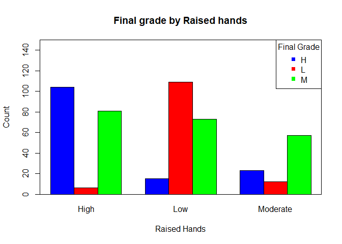<!-- -->

###Discussion vs Final grade of students


```r
counts <- table(edu$Class, edu$DiscussBinned,
                dnn=c("Final Grade", "Discussion"))

#proportion over rows
row.margin <- round(prop.table(counts, margin = 1),4)*100

#proportion over columns
col.margin <- round(prop.table(counts,margin = 2), 4)*100

#We notice that students with high performance tend to have low discussion, but we need 
# further analysis to explore this better.The overlay bar graph shows similar results.

#overlay bar chart of grades by discussion
ggplot() +
  geom_bar(data=edu,
           aes(x = factor(edu$Class),
               fill = factor(edu$DiscussBinned)),
           position = "fill") +
  scale_x_discrete("Final Grade") +
  scale_y_continuous("Percent") +
  guides(fill=guide_legend(title="Discussion")) +
  scale_fill_manual(values=c("blue", "red", "green"))
```

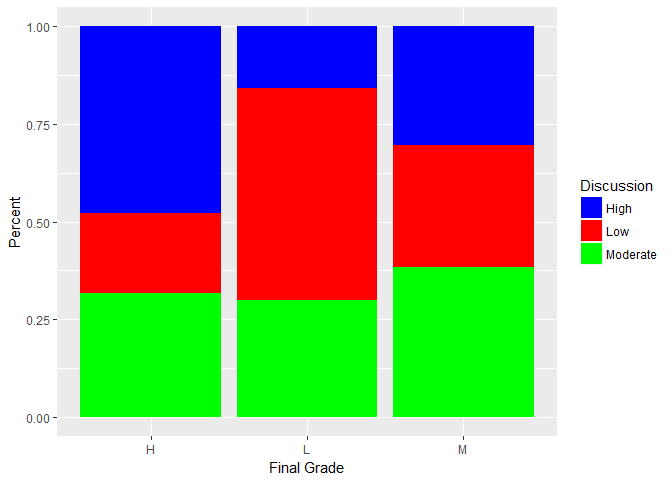<!-- -->

###Announcements viewing vs Final grade of students


```r
#Table of counts for Viewing Announcements and final grade
counts <- table(edu$Class, edu$announcementsBinned,
                dnn=c("Final Grade", "Viewing Announcements"))
#proportion over rows
row.margin <- round(prop.table(counts, margin = 1),4)*100
#proportion over columns
col.margin <- round(prop.table(counts,margin = 2), 4)*100

#clustered bar chart of Viewing Announcements by Final grade
barplot(t(counts),
        col = c("blue", "red", "green"),
        ylim = c(0, 150),
        ylab = "Counts",
        xlab = "Final Grades",
        main = "Viewing Announcements Count by Final Grade",
        beside = TRUE)
legend("topright",
       c(colnames(counts)),
       col = c("blue", "red", "green"),
       pch = 15,
       title = "Viewing Announcements")
box(which = "plot",
    lty = "solid",
    col="black")
```

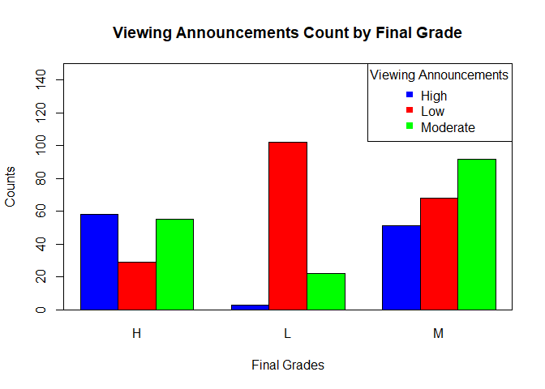<!-- -->

###Resources Visted by students vs Final grade of students


```r
counts <- table(edu$Class, edu$visitedBinned,
                dnn=c("Final Grade", "Visiting Resources"))
#proportion over rows
row.margin <- round(prop.table(counts, margin = 1),4)*100
#proportion over columns
col.margin <- round(prop.table(counts,margin = 2), 4)*100

#overlay bar chart of grades by viewing announcements
ggplot() +
  geom_bar(data=edu,
           aes(x = factor(edu$Class),
               fill = factor(edu$visitedBinned)),
           position = "fill") +
  scale_x_discrete("Final Grade") +
  scale_y_continuous("Percent") +
  guides(fill=guide_legend(title="Visiting Resources")) +
  scale_fill_manual(values=c("blue", "red", "green"))
```

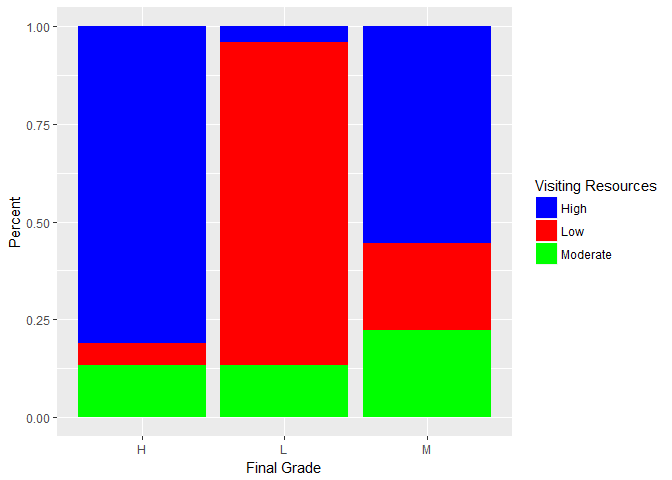<!-- -->

```r
#It is made very obvious by this chart that students with low grades did not 
# visit the resources frequently.
#Students with high performance visited moderately.
```

###Absence from classes vs Final grade of students


```r
#Table of counts for Absence and final grade
counts <- table(edu$Class, edu$StudentAbsenceDays,
                dnn=c("Final Grade", "Absence"))
#proportion over rows
row.margin <- round(prop.table(counts, margin = 1),4)*100
#proportion over columns
col.margin <- round(prop.table(counts,margin = 2), 4)*100
#clustered bar chart of final grade by Absence
barplot(counts,
        col = c("blue", "red", "green"),
        ylim = c(0, 150),
        ylab = "Count",
        xlab = "Absence",
        main = "Final grade by Absence",
        beside = TRUE)
legend("topright",
       c(rownames(counts)),
       col = c("blue", "red", "green"),
       pch = 15,
       title = "Final Grade")
box(which = "plot",
    lty = "solid",
    col="black")
```

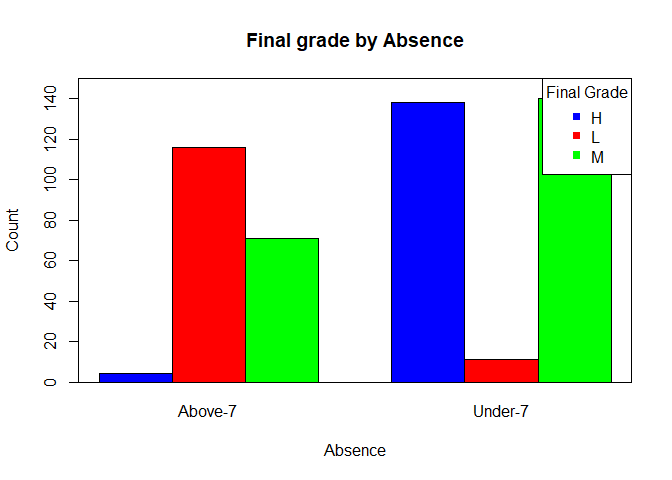<!-- -->

```r
#It is made very obvious by this chart that absence above 7 days leads to low 
#performance.
#Students with high performance have very low absence days.
```

##Partitioning dataset into test and train dataset


```r
#Partition the data into 75% training data and 25% testing data
edu$part <- runif(length(edu$Class),
                  min = 0,
                  max = 1)

training_edu <- edu[edu$part <= 0.75,]
testing_edu <- edu[edu$part > 0.75,]

#remove partition variable from training dataset: $part (22nd column)
training_edu<-training_edu[,-22]

#remove partition variable from testing dataset: $part (22nd column)
testing_edu<-testing_edu[,-22]
```
###Check validilty of partition for academic information:

```r
testing_acad<-table(testing_edu$Semester)
training_acad<-table(training_edu$Semester)

table_academic <- as.table(rbind(training_acad,
                                 testing_acad))
dimnames(table_academic) <- list(Data.Set =
                                   c("Training Set", "Test Set"),
                                 Semester = c("Fall","Spring"))
Xsq_data <- chisq.test(table_academic)
# Show the test statistic,p-value, expected frequencies
```
Test Statistic:

```r
Xsq_data$statistic  #1.02259811
```

```
##    X-squared 
## 2.376895e-30
```
P-value:

```r
Xsq_data$p.value 
```

```
## [1] 1
```


```r
Xsq_data$expected
```

```
##               Semester
## Data.Set            Fall    Spring
##   Training Set 173.54167 166.45833
##   Test Set      71.45833  68.54167
```


We can see that p value is greater than 0.05.
Therefore, we accept the null hypothesis.Hence, the partition is valid.There is no significant difference in the proportions.

###Check validilty of partition for behavioral information:


```r
testing_behav<-table(testing_edu$DiscussBinned)
training_behav<-table(training_edu$DiscussBinned)

table_behavioral <- as.table(rbind(training_behav,
                                   testing_behav))
dimnames(table_behavioral) <- list(Data.Set =
                                     c("Training Set", "Test Set"),
                                   Discussion = c("High","Low","Moderate"))

Xsq_data <- chisq.test(table_behavioral)
# Show the test statistic,
# p-value, expected frequencies
Xsq_data$statistic  #1.770226
```

```
## X-squared 
##  2.440103
```

```r
Xsq_data$p.value #0.4126674
```

```
## [1] 0.2952149
```

```r
Xsq_data$expected 
```

```
##               Discussion
## Data.Set            High       Low  Moderate
##   Training Set 107.66667 116.16667 116.16667
##   Test Set      44.33333  47.83333  47.83333
```

```r
#Discussion
#              Discussion
#  Data.Set            High       Low  Moderate
#  Training Set 115.58333 126.98958 122.42708
#  Test Set      36.41667  40.01042  38.57292

#We can see that p value is greater than 0.05.
#Therefore, we accept the null hypothesis.Hence, the partition is valid.There is no
#significant difference in the proportions.
```

###Random Forest


```r
str(training_edu)
```

```
## 'data.frame':	340 obs. of  21 variables:
##  $ gender                  : chr  "M" "M" "M" "F" ...
##  $ NationalITy             : chr  "KW" "KW" "KW" "KW" ...
##  $ PlaceofBirth            : chr  "KuwaIT" "KuwaIT" "KuwaIT" "KuwaIT" ...
##  $ StageID                 : chr  "lowerlevel" "lowerlevel" "lowerlevel" "lowerlevel" ...
##  $ GradeID                 : chr  "G-04" "G-04" "G-04" "G-04" ...
##  $ SectionID               : chr  "A" "A" "A" "A" ...
##  $ Topic                   : chr  "IT" "IT" "IT" "IT" ...
##  $ Semester                : chr  "F" "F" "F" "F" ...
##  $ Relation                : chr  "Father" "Father" "Father" "Father" ...
##  $ raisedhands             : int  10 30 40 42 35 12 50 20 62 36 ...
##  $ VisITedResources        : int  7 25 50 30 12 21 88 14 70 30 ...
##  $ AnnouncementsView       : int  0 5 12 13 0 16 30 12 44 20 ...
##  $ Discussion              : int  30 35 50 70 17 50 80 19 60 80 ...
##  $ ParentAnsweringSurvey   : chr  "No" "No" "No" "Yes" ...
##  $ ParentschoolSatisfaction: chr  "Bad" "Bad" "Bad" "Bad" ...
##  $ StudentAbsenceDays      : chr  "Above-7" "Above-7" "Above-7" "Above-7" ...
##  $ Class                   : chr  "L" "L" "M" "M" ...
##  $ raisedhandsBinned       : chr  "Low" "Low" "Moderate" "Moderate" ...
##  $ visitedBinned           : chr  "Low" "Low" "Moderate" "Low" ...
##  $ announcementsBinned     : chr  "Low" "Low" "Low" "Low" ...
##  $ DiscussBinned           : chr  "Moderate" "Moderate" "Moderate" "High" ...
```

```r
#Change char datatype to factor for the following columns
training_edu$NationalITy<-as.factor(training_edu$NationalITy)
training_edu$Relation<-as.factor(training_edu$Relation)
training_edu$Topic<-as.factor(training_edu$Topic)
training_edu$StudentAbsenceDays<-as.factor(training_edu$StudentAbsenceDays)
training_edu$Class<-as.factor(training_edu$Class)
training_edu$Semester<-as.factor(training_edu$Semester)

set.seed(123)
modelRandom<-randomForest(Class~VisITedResources+AnnouncementsView+Relation+Topic+raisedhands+Discussion+StudentAbsenceDays,data=training_edu,mtry=2,ntree=450,importance=TRUE)
```
Plot varibale importance


```r
varImpPlot(modelRandom,type = 2)
```

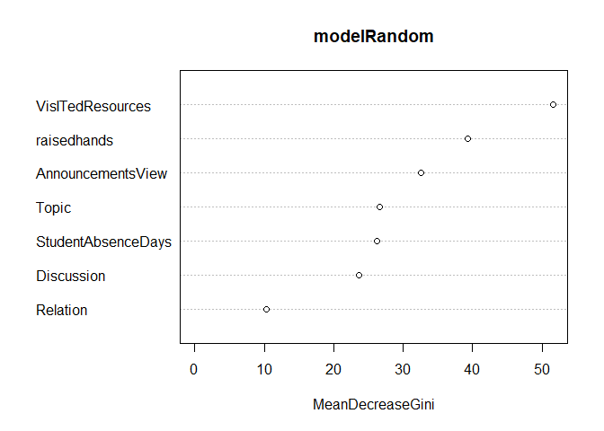<!-- -->
OOB estimate of error: 22.4%


```r
modelRandom
```

```
## 
## Call:
##  randomForest(formula = Class ~ VisITedResources + AnnouncementsView +      Relation + Topic + raisedhands + Discussion + StudentAbsenceDays,      data = training_edu, mtry = 2, ntree = 450, importance = TRUE) 
##                Type of random forest: classification
##                      Number of trees: 450
## No. of variables tried at each split: 2
## 
##         OOB estimate of  error rate: 23.82%
## Confusion matrix:
##    H  L   M class.error
## H 67  0  33   0.3300000
## L  0 79  10   0.1123596
## M 25 13 113   0.2516556
```
